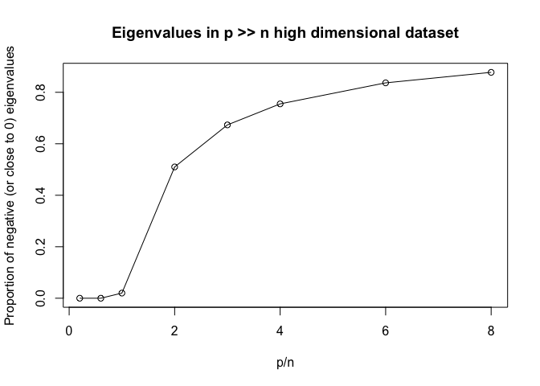

# Eigen_HD_data


Main theme: Simulation to show that if p \>\> n, then the variance
covariance matrix becomes noiser and noisier, which leads to increasing
proportion of negative (or very close to 0) eigenvalues.

Generate some very high dimensional data (50 data points with p
features)

``` r
p_list <- c(10,30,50,100,150,200, 300, 400)

p_over_n <- p_list / 50
neg_eigen <- c()

for(p in p_list){
  tested_df <- matrix(NA, ncol = p, nrow = 50)
  colnames(tested_df) <- c(paste0(rep("V",p), 1:p))
  
  tested_df <- data.frame(tested_df)
  for(i in (1:p)){
    sampled_mean <- sample(1:100, 1)
    sampled_sigma <- sample(1:10,1)
    tested_df[i] <- rnorm(50, mean = sampled_mean, sd = sampled_sigma)
    
  }
  
  var_covar_mat <- var(tested_df)
  
  number_violated_eigen <- sum(eigen(var_covar_mat)$values < 10^(-10))
  
  neg_eigen <- c(neg_eigen, number_violated_eigen / p)
  
}

par(mfrow = c(1,1))
plot(p_over_n, neg_eigen, xlab = "p/n", ylab = "Proportion of negative (or close to 0) eigenvalues", main = "Eigenvalues in p >> n high dimensional dataset")
lines(p_over_n, neg_eigen)
```



For our toy examples of 50 observations, as long as p \>\>n, it will
produce a lot of negative or close to 0 eigenvalues, which will affect
our inverse matrix estimation
